 ## Lab: [Splunk Capstone]

---


> [!ABSTRACT] Executive Summary
> **What Happened:** On July 17, 2025, an initial compromise occurred when a user downloaded a malicious zip archive (`Invoices.zip`) via a web browser. This archive contained a JavaScript dropper (`Invoice_2326.js`), which executed a PowerShell command to download and launch a Remote Access Trojan (`netsupport.exe`). The attacker established deep persistence via registry Run keys, a reverse SSH tunnel, and the creation of a rogue local user account (`WDAGUtilityAccount2`). After disabling Windows Defender and adding path exclusions, the attacker dumped credentials from LSASS memory. Leveraging stolen credentials for the user `aclark`, the attacker utilized WMIC to modify firewall rules and move laterally to the Domain Controller (DC01). Ultimately, the Active Directory database was fully dumped and compressed into a zip file on the root of the C:\ drive, staging it for exfiltration.


### 2. Incident Scope

- **Identities:**
    - `danderson` (Local user account compromised during initial access).
    - `ServiceAdmin` (Domain account targeted during reconnaissance).
    - `aclark` (Domain User compromised and actively utilized for lateral movement).

- **Endpoints:**
    - `IT-WS01` (Workstation; initial access point and staging environment).
    - `DC01` (Domain Controller; targeted for lateral movement and AD database exfiltration).

- **Network:**
    - `10[.]10[.]11[.]216` (DC01 internal target IP).


---


 ## Tools & Environments Used

* Splunk (For viewing and filtering logs)


---


 ## Critical Indicators of Compromise (IOCs)

#### Network & Identity Indicators

| **Type**   | **Indicator / Value** | **Context / Mapping**                                                                             |
| ---------- | --------------------- | ------------------------------------------------------------------------------------------------- |
| IP Address | `10[.]10[.]5[.]100`   | Command & Control (C2) destination over port 9001.                                                |
| IP Address | `10[.]10[.]5[.]142`   | Staging server for PowerShell script delivery and target for the reverse SSH tunnel on port 2222. |
| Account    | WDAGUtilityAccount2   | Rogue local account created by the attacker disguised as a built-in utility account.              |

#### Malicious URLs

| **Source IP**         | **Staging / Delivery URL**                                    |
| --------------------- | ------------------------------------------------------------- |
| `54[.]93[.]195[.]233` | `hxxp[://]54[.]93[.]195[.]233:8888/mimikatz/x64/mimikatz.exe` |
| `54[.]93[.]195[.]233` | `hxxp[://]54[.]93[.]195[.]233:8888/OneDrlvee.exe`             |
| `54[.]93[.]195[.]233` | `hxxp[://]54[.]93[.]195[.]233:8888/PsExec64.exe`              |

**Host-Based Indicators**

- **File:** `Invoices.zip`
    - **Artifact Type:** Delivery Archive
    - **Context:** Initial malicious zip file downloaded by the victim via a web browser to `C:\Users\danderson\Downloads\`.

- **File:** `Invoice_2326.js`
    - **Artifact Type:** JavaScript Dropper
    - **Context:** Executed via WScript to reach out and pull down the secondary PowerShell payload.

- **File:** `netsupport.exe`
    - **Artifact Type:** Remote Access Trojan (RAT) / Credential Dumper
    - **Context:** Downloaded and executed from `AppData\Roaming\` directories to establish C2, perform credential dumping from LSASS, and achieve persistence.

- **Registry Key:** `HKU\...\SOFTWARE\Microsoft\Windows\CurrentVersion\Run\NetSupport`
    - **Artifact Type:** Persistence Mechanism
    - **Context:** Run key pointing to the `netsupport.exe` binary to ensure it automatically relaunches upon victim login.

- **File:** `Data_backup_20250716.zip`
    - **Artifact Type:** Exfiltration Staging File
    - **Context:** A compressed archive of the Active Directory database (`ntds.dit`) staged by the attacker on the root of DC01 for exfiltration.


---


 ## MITRE ATT&CK Mapping
| **Tactic**              | **Technique**                                              | **ID**                | **Description**                                                                                                                   |
| ----------------------- | ---------------------------------------------------------- | --------------------- | --------------------------------------------------------------------------------------------------------------------------------- |
| **Initial Access**      | Phishing: Spearphishing Attachment                         | T1566.001             | A malicious zip file (`Invoices.zip`) containing a JavaScript dropper was downloaded by the user via Microsoft Edge.              |
| **Execution**           | Command and Scripting Interpreter: JavaScript / PowerShell | T1059.007 / T1059.001 | `Invoice_2326.js` executed via WScript, immediately triggering a hidden PowerShell command to download and evaluate `update.ps1`. |
| **Command and Control** | Non-Standard Port                                          | T1571                 | The `netsupport.exe` payload successfully established outbound connections to the C2 server at `10[.]10[.]5[.]100` on port 9001.  |
| **Persistence**         | Boot or Logon Autostart Execution: Registry Run Keys       | T1547.001             | A registry Run key (`NetSupport`) was created to ensure the RAT executes automatically upon user login.                           |
| **Persistence**         | Create Account: Local Account                              | T1136.001             | The attacker created a rogue local account named `WDAGUtilityAccount2` utilizing a specific password (`Decryptme1488@`).          |
| **Persistence**         | Scheduled Task/Job                                         | T1053.005             | Tasks named "SSH Key Exchange" and "SSH Server" were created to maintain a reverse SSH tunnel.                                    |
| **Defense Evasion**     | Impair Defenses: Disable or Modify Tools                   | T1562.001             | Added a Windows Defender scanning exclusion path for `C:\Users\Public` and disabled Behavior Monitoring via PowerShell.           |
| **Credential Access**   | OS Credential Dumping: LSASS Memory                        | T1003.001             | `netsupport.exe` accessed `lsass.exe` memory to dump live credentials.                                                            |
| **Lateral Movement**    | Windows Management Instrumentation                         | T1047                 | Leveraged WMIC and the compromised `aclark` credentials to remotely adjust firewall rules and execute commands on DC01.           |
| **Collection**          | OS Credential Dumping: NTDS                                | T1003.003             | Utilized the legitimate `ntdsutil.exe` tool on DC01 to create a full install-from-media backup of the Active Directory database.  |
| **Collection**          | Archive Collected Data                                     | T1560                 | Compressed the dumped AD database into `Data_backup_20250716.zip` using the PowerShell `Compress-Archive` cmdlet.                 |


---


 ## Investigation Methodology & Walkthrough

 ### Step 1: Investigating Initial Access

First, we need to find the file that was downloaded from email using Sysmon Event Id 11, host as **IT-WS01**, and mainly, to isolate file creations that were downloaded via web browser rather than one created by the system with the following:

```spl
index="main" source="xmlwineventlog:microsoft-windows-sysmon/operational" host="IT-WS01" EventCode=11 (TargetFilename="*.exe*" OR TargetFilename="*.bat*" OR TargetFilename="*.zip*") (Image="*msedge.exe*" OR Image="*firefox.exe*" OR Image="*chrome.exe*")
| table _time, Image, TargetFilename, User
```


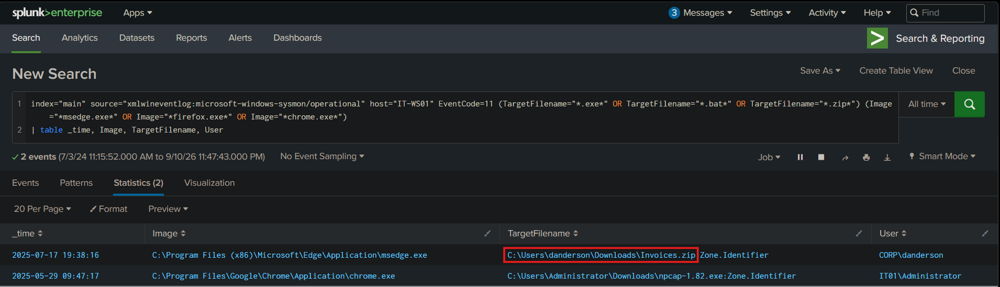


A zip file (`Invoices.zip`) on its own doesn't do anything and we need to see what lies inside it, for which we need Sysmon Event Id 15 which records file stream creation, including the moment a file inside an archive is accessed, which can be further enhanced via extension filtering.

```spl
index="main" source="xmlwineventlog:microsoft-windows-sysmon/operational" host="IT-WS01" EventCode=15 "Invoices.zip" (TargetFilename="*.js*" OR TargetFilename="*.vbs*" OR TargetFilename="*.hta*" OR TargetFilename="*.exe*")
| table _time, Image, TargetFilename, Contents
```


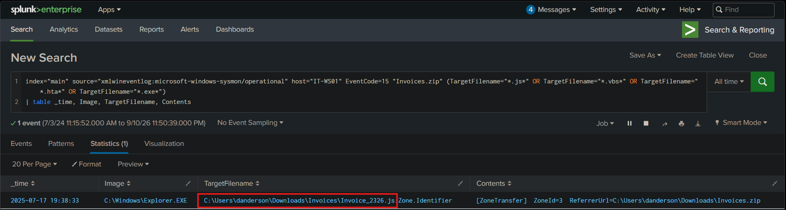


 ### Investigating Execution

We have a JS dropper (`Invoice_2326.js`) that was ran, and since the dropper's main purpose is to reach out and pull down the real payload which is done via a script, which we can use sysmon Event Id 1 with **ParentCommandLine** containing the name of the dropper to find every process that the script itself started so that we can find the exact process linking the dropper to the script without sifting through thousands of processes.

```spl
index="main" source="xmlwineventlog:microsoft-windows-sysmon/operational" host="IT-WS01" EventCode=1 ParentCommandLine="*Invoice_2326.js*"
| table _time, ParentCommandLine, CommandLine
```


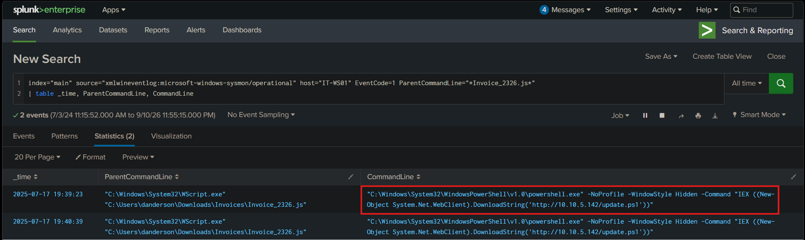


Now we can see that a powershell script is downloaded from `10[.]10[.]5[.]142` and is executed instantly with **IEX**. This is a classic 2 stage dropper pattern, where the initial `.js` dropper was disposable and only used to fetch a more capable Powershell script. Now that a script file has been created, we can use Sysmon Event Id 11 to find what has this stage of the chain dropped and since the script was executed as soon as it was downloaded, the file creation windows could have been created within a 1 minute window to filter more effectively.

```spl
index="main" source="xmlwineventlog:microsoft-windows-sysmon/operational" host="IT-WS01" EventCode=11 Image="*powershell.exe*" earliest="07/17/2025:19:39:23" latest="07/17/2025:19:40:23"
| table _time, Image, TargetFilename, User
```


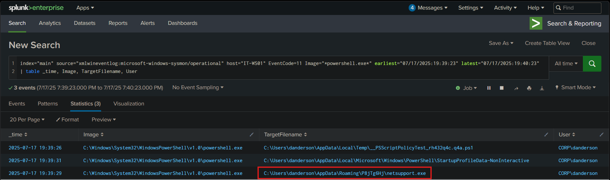


We can see that an executable `netsupport.exe` has been created, but it has not been executed.


 ### Investigating Command & Control

What makes it dangerous is if it is making any network connections outwards, which can serve as a C2 channel. To find that out, use Sysmon Event Id 3 and filter the image name as the executable netsupport.exe found earlier. Else, Security Event Id 5156 logs would also suffice

```spl
index="main" source="xmlwineventlog:microsoft-windows-sysmon/operational" host="IT-WS01" EventCode=3 Image="*netsupport.exe*"
| table _time, Image, DestinationIp, DestinationPort, SourceIp
| top limit=10 DestinationIp, DestinationPort
```

```spl
index="main" source="xmlwineventlog:security" host="IT-WS01" EventCode=5156 Application="*netsupport.exe*"
| table _time, Application, DestAddress, DestPort, SourceAddress, Protocol, Direction
| top limit=10 DestAddress, DestPort
```


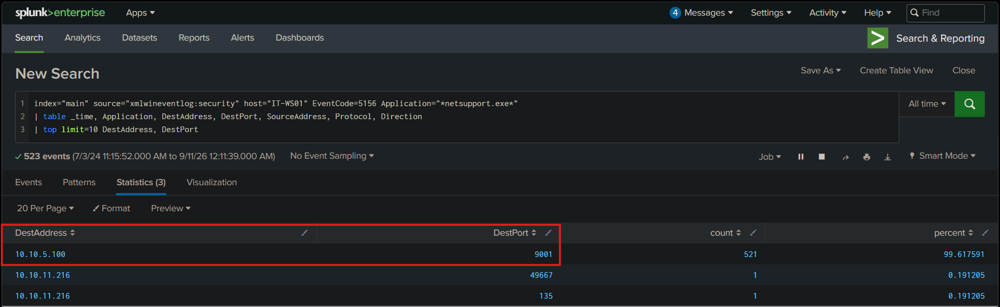


 ### Investigating Persistence

A RAT is a live command channel that dies the moment the machine reboot or the process is terminated. So, an attacker never relies on a single thread of access. The most common way to achieve persistence is a registry **Run** key. Anything listed under a **Run** key is executed automatically the user logs in. So, we can use Sysmon Event Id 13 here, which records registry value changes, so we can filter it via **Run** key path.

```spl
index="main" source="xmlwineventlog:microsoft-windows-sysmon/operational" host="IT-WS01" EventCode=13 TargetObject="*\\CurrentVersion\\Run*" "*netsupport.exe*"
| table _time, Image, TargetObject, Details, EventType
```


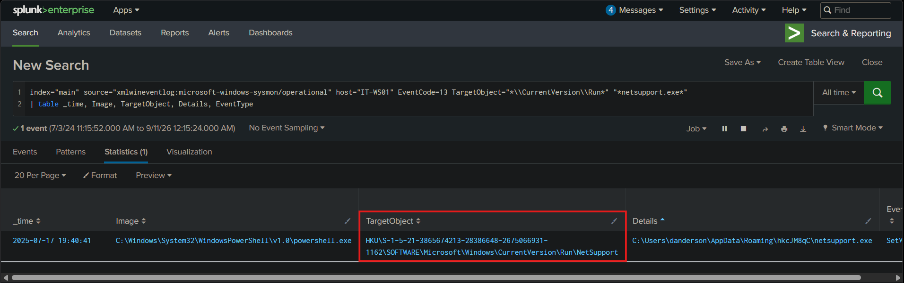


Now with registry key in `\Run`, the RAT relaunches every time the victim logs in; no attacker action required. Another sneakier mechanism is a reverse SSH tunnel. Instead of the attacker connecting in, the victim connects out to the attacker and hands back a shell, which slips past inbound firewall rules. This can be found via Sysmon Event Id 1, which exposes the full command line, where the tunnel configuration and listening port reside, so it is the only source that shows exactly how the SSH persistence was set up.

```spl
index="main" source="xmlwineventlog:microsoft-windows-sysmon/operational" host="IT-WS01" EventCode=1 (Image="*ssh.exe" OR CommandLine="*ssh*")
| table _time, CommandLine, ParentCommandLine
```


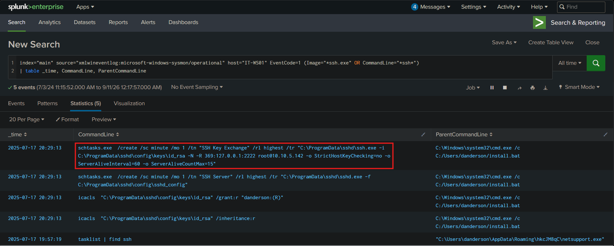


Yet another mechanism for persistence is creating a brand-new user account, a foothold that survives even if the malware is removed entirely. These can be filtered with Security Event Id 4720.

```spl
index="main" source="xmlwineventlog:security" host="IT-WS01" EventCode=4720
| table _time, TargetUserName, SubjectUserName, SamAccountName, PrivilegeList
| sort + _time
```


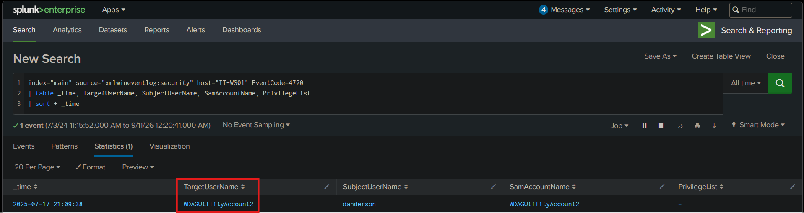


Now that a user has been created by the name of **WDAGUtilityAccount2** which is deliberately close to a real, built-in system identity to hide in plain sight among normal accounts, now we have to find its password, for which we need to hunt for process creation command `net user` with an `/add` flag via Sysmon Event Id 1.

```spl
index="main" source="xmlwineventlog:microsoft-windows-sysmon/operational" host="IT-WS01" EventCode=1 (CommandLine="*net user*" AND CommandLine="*/add*")
| table _time, CommandLine, ParentCommandLine
```


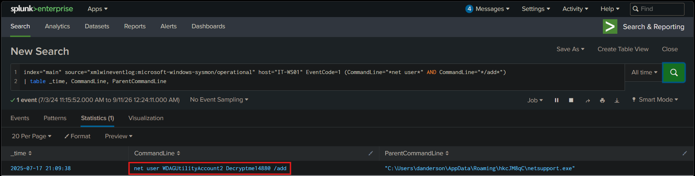


 ### Investigating Defense Evasion

Now that the user has established persistence via 3 separate methods, their priority shifts to staying invisible. Microsoft Defender is the primary obstruction for them, so they try to weaken it. One method is to carve out a blindspot, which is usually used by admins to exclude folder from scanning, which is abused by attackers to create a safe zone where their tools are never executed. This can be done via Defender Event Id 5007 and filtering out **Exclusions** keyword.

```spl
index="main" source="xmlwineventlog:microsoft-windows-windows defender/operational" host="IT-WS01" EventCode=5007 New_Value="*Exclusions*"
| table _time, Old_Value, New_Value
```


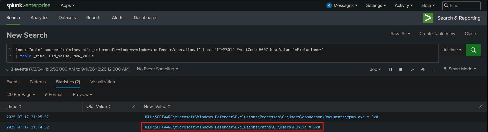


Now that the folder `C:\Users\Public` is invisible to Defender, anything dropped in that folder is now invisible to Defender's scanning. Folder name is also deliberately chosen to resemble a legitimate system directory. Another more aggressive way is to disable the whole protection feature. This is done via Powershell via `Set-MpPreferende` cmdlet, which means we can use Powershell Event Id 4104 to find it.

```spl
index="main" source="xmlwineventlog:windows powershell" host="IT-WS01" ("*MpPreference*" AND *Disable*)
```


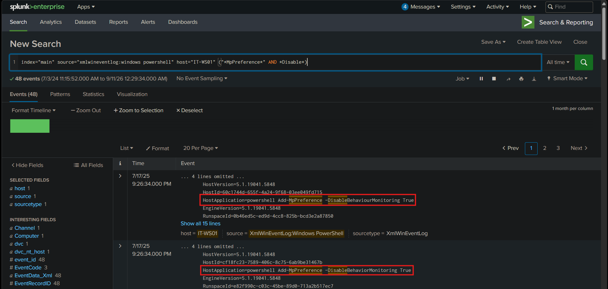


 ### Investigating Credential Access

Now the attacker has hidden their tools as well as blinded the antivirus. The next step is credential harvesting that will allow them deeper access into the environment. This is done in 2 steps, first they look around for valuable accounts, then they steal credentials. The way to do the first step is via reconnaissance. Reconnaissance on windows is done via `net user` command, which is a process to be filtered out via Sysmon Event Id 1.

```spl
index="main" source="xmlwineventlog:microsoft-windows-sysmon/operational" host="IT-WS01" EventCode=1 CommandLine="*net user*"
| table _time, CommandLine, ParentCommandLine, User, OriginalFileName
```


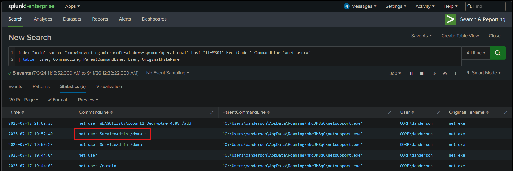


After recon, we can infer that attacker has found a user account to target (**ServiceAdmin**), which is a service account, which are prime targets because of elevated access and never expiring passwords. Here, the second step of credential harvesting comes - stealing live credentials. The most direct way to do that is to read them out of the memory of `lsass.exe`, the Windows process that holds password hashes and Kerberos tickets for logged-on users. Tools like `mimikatz` do this by opening LSASS memory, which triggers Sysmon Event Id 10, i.e., one process accessing another's memory, which is the only telemetry that captures one process opening another process's memory, so filtering `TargetImage` to lsass.exe surfaces credential-dumping attempts that no file or network log would show.

```spl
index="main" source="xmlwineventlog:microsoft-windows-sysmon/operational" host="IT-WS01" EventCode=10 TargetImage="*lsass.exe*"
| table _time, SourceImage, TargetImage, GrantedAccess, CallTrace
```


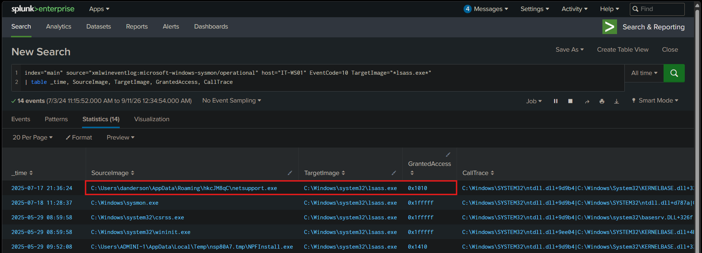


 ### Investigating Lateral Movement

Now that the attacker has potentially stolen credentials, the attacker will now aim to laterally move to greater value targets like Domain Controller (`DC-01`). Lateral movement involves 2 pieces working together: a remote-execution technique and a firewall change to let it through.  A common technique for running commands on a remote Windows host is **WMIC**, the CLI to Windows Management Instrumentation, which lets one machine execute a process on another machine over the internet, making it ideal for lateral movement. Since **WMIC** is a command, we use Sysmon Event Id 1 with **wmic** filter along with the **timestamp from the initial access** via zip file for further precision.

```spl
index="main" source="xmlwineventlog:microsoft-windows-sysmon/operational" host="IT-WS01" EventCode=1 CommandLine="*wmic*" earliest="07/17/2025:19:38:16"
| table _time, CommandLine, ParentCommandLine
```


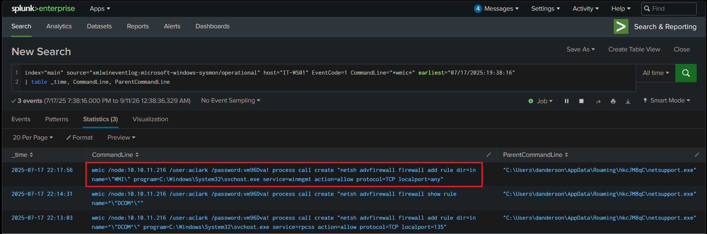


We can determine that the account with Username **aclark** has been compromised. Now, WMIC only works over the internet if the DC's firewall allows the connection, and by default, it may not. So before running WMIC, the attacker opens a hole. Firewall changes are made with the `netsh` command, which we can hunt on the Domain Controller itself using Sysmon Event Id 1.

```spl
index="main" source="xmlwineventlog:microsoft-windows-sysmon/operational" host="IT-WS01" EventCode=1 CommandLine="*netsh*" earliest="07/17/2025:19:38:16"
| table _time, CommandLine, ParentCommandLine
```


We can see that the `netsh` command has added a new inbound firewall rule allowing connections to the `winmgmt` service to any local port. This way, the firewall opens for WMI, which then uses WMIC with the stolen credentials to execute on the DC.


 ### Investigating Collection & Exfiltration Staging

On a DC, often the main goal is related to `ntds.dit`, where the Active Directory database lives. `ntdsutil.exe` is a legitimate admin tools that can create a full copy of it through an **Install From Media** operation, and this is exactly what attackers abuse to dump the database quietly. We can hunt for its executing via Sysmon Event Id 1 and filtering for the tool.

```spl
index="main" source="xmlwineventlog:microsoft-windows-sysmon/operational" host="dc01" EventCode=1 CommandLine="*ntdsutil*" earliest="07/17/2025:19:38:16"
| table _time, CommandLine, ParentCommandLine
```


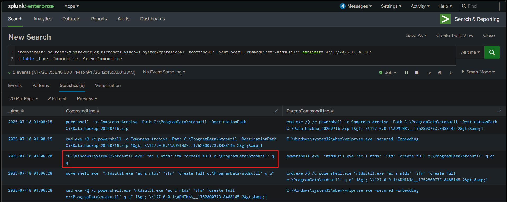


We can see that `ntdsutil.exe` has ran in Install From Media mode, writing a complete dump of the AD database to the folder `C:\ProgramData\ntdsutil`, and at this moment, we can say with certainty that this was a full-domain compromise. If the end goal is data exfiltration, the smaller the data, the better. Raw dumped files, like the one earlier, are too bulky and obvious. So, attackers almost always compress their loot before moving it out, both to shrink it and to bundle everything in one neat package. This step called Exfiltration Staging can be caught in 2 ways, via Powershell Event id 4104 that record the compression command or via Sysmon Event Id that records the event for the archive itself.

```spl
index="main" source="xmlwineventlog:microsoft-windows-sysmon/operational" host="dc01" EventCode=1 CommandLine="*Compress-Archive*" earliest="07/17/2025:19:38:16"
| table _time, CommandLine, ParentCommandLine
```


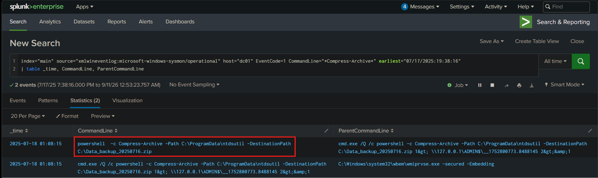


The final command, as we have seen has compressed the dumped database and saved it at the root of the `c:\` drive. This the the attacker's finished product, staged and ready to be exfiltrated from the network.

---

 ## Recommendations & Remediation

---

Based on the forensic artifacts discovered in the event logs, the following actions are recommended to contain and eradicate the threat:


 ### Immediate Containment Actions

- **Host Isolation:** Network-isolate the affected workstation **IT-WS01** and Domain Controller **DC01** (IP: `10[.]10[.]11[.]216`) immediately using the EDR console to prevent further exfiltration of the staged AD database.

- **Process Termination:** Terminate the rogue `netsupport.exe` processes, active SSH tunnel connections, and suspicious PowerShell/WScript instances on the live hosts if they are still running.

- **Network Blocking:** Implement block rules at the perimeter firewall and proxy for the known malicious IPs `10[.]10[.]5[.]100` and `10[.]10[.]5[.]142` across all ports.

- **Account Suspension:** Immediately disable the compromised **aclark** domain account and delete the rogue **WDAGUtilityAccount2** local account.


 ### Eradication & Recovery

- **Artifact Removal:** Locate and securely delete the initial payloads (`Invoices.zip`, `Invoice_2326.js`), the RAT binaries (`netsupport.exe`), and the staged exfiltration file (`Data_backup_20250716.zip`) from the Domain Controller.

- **Persistence Cleanup:** Investigate the Task Scheduler for the persistence mechanisms named "SSH Key Exchange" and "SSH Server" and delete them. Remove the `NetSupport` registry Run key.

- **Defense Restoration:** Revert the malicious Windows Defender changes. Remove the folder exclusion for `C:\Users\Public` and re-enable Behavior Monitoring globally via group policy.

- **Credential Rotation:** Because OS credential dumping occurred and the Active Directory database (`ntds.dit`) was staged for exfiltration, a full domain-wide credential rotation (including the `krbtgt` account) is strictly required. Treat all credentials as compromised.

- **Re-imaging:** Due to the severity of the system-level compromise, reverse tunnels, and impaired defenses, full re-imaging of **IT-WS01** and a secure restoration of **DC01** from a known-clean backup is recommended after extracting necessary disk artifacts.


 ### Post-Incident Review (Lessons Learned)

- **Defense Gap Identified:** The malware successfully established a foothold because email/web gateway filters permitted the download of an archive containing an executable script (`.js`), and there were no restrictions preventing `WScript.exe` from spawning hidden PowerShell processes. Additionally, unconstrained lateral WMI traffic allowed swift compromise of the Domain Controller.

- **Strategic Recommendation:** Implement strict web filtering for risky file extensions in archives. Deploy Windows Attack Surface Reduction (ASR) rules to block JavaScript/VBScript payloads and prevent Office/WScript processes from spawning child processes. Restrict lateral WMI/SMB traffic specifically to dedicated management subnets via host-based firewalls.

